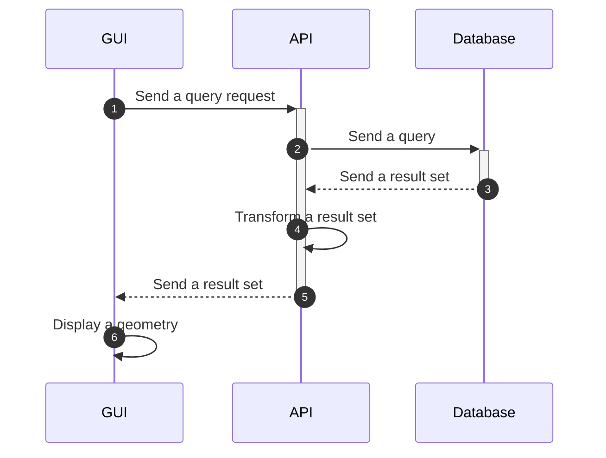
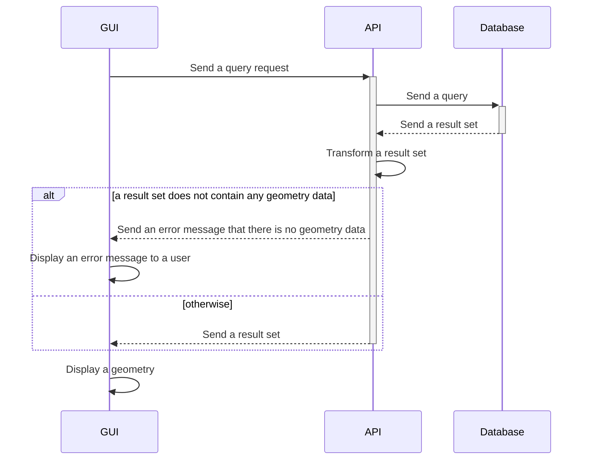
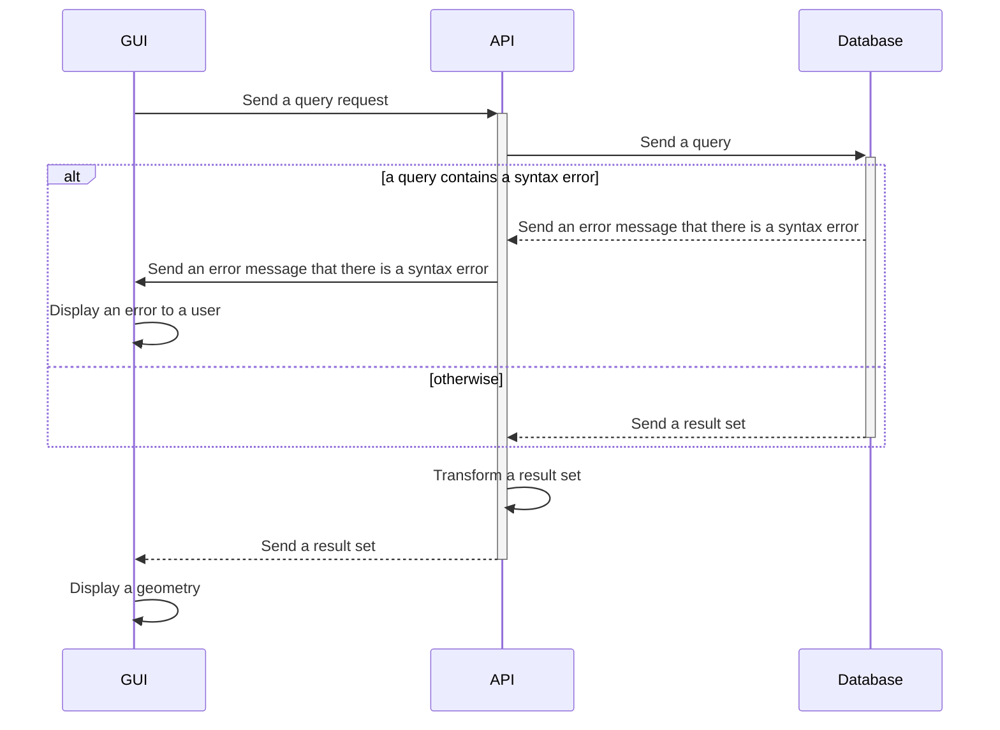

# Oracle SDO Geometry viewer

A university project to create a viewer of SDO geometry objects of the Oracle database. For this project, I have chosen to use Rust and [egui](https://github.com/emilk/egui/tree/master) library for GUI development.

Unfortunately, [rust-oracle](https://github.com/kubo/rust-oracle) uses a thick ODPI-C client that is not available on Mac [ARM computers](https://stackoverflow.com/q/74225139). It is also quite troublesome to install the ODPI-C client via [Rosetta](https://developers.ascendcorp.com/how-to-install-oracle-instant-client-on-apple-silicon-m1-24b67f2dc743) or Docker.

Therefore, I decided to separate the GUI from database queries and instead make requests to the backend that uses a thin database client. I found two libraries that allow thin clients [node-oracledb](https://github.com/oracle/node-oracledb) and [python-oracledb](https://github.com/oracle/python-oracledb). Thin clients directly connect to the database without the [help of the driver](https://medium.com/oracledevs/usher-in-a-new-era-with-the-node-oracledb-6-0-pure-javascript-thin-driver-e10e2af693b2). One more option was to use Java and an Oracle official JAR file, but I just did not want to work with Java :smile:.

I chose to use `python-oracledb` because I am familiar with it and I wanted to try [FastAPI](https://fastapi.tiangolo.com/).

## Running the project

To run with Docker:

To run the Python backend:

To run Rust egui:

## Process description

Communication between services is going to be pretty straightforward. GUI connects to the backend and the backend connects to the database. GUI does not do any actions with the database and it just uses a middle-man to get results to draw. **Be aware** that it is not going to be a production-ready product, but it is more of a learning project where security is in the last place, so no security checks will be done on the backend side. In real environments when we get raw SQL queries, security checks must be done.

The communication diagram is displayed below. As was mentioned, the Backend stays as a middle-man between database and GUI. GUI's goal is to display results, Backend's goal is to get those results and transform them into an understandable format and the database just stores results.

### Communication scenarios

In the following diagram, a successful scenario is displayed:

In the next diagram, a user sends an incorrect SQL query that does not query any geometry data:

In the last scenario diagram, a user sends a SQL query that contains any syntax error:

## GUI model

